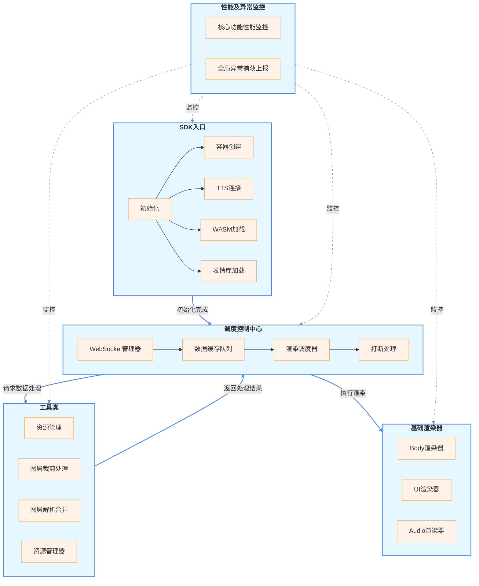
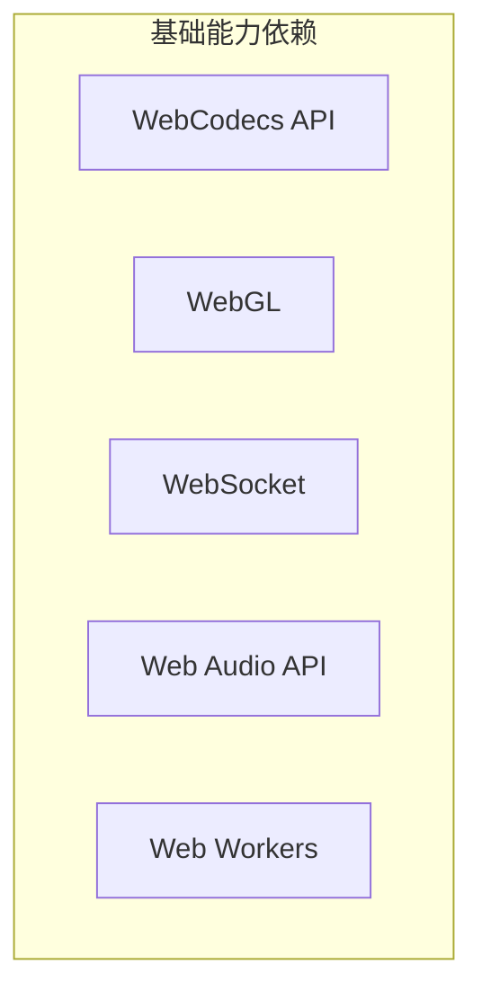

# 离线数字人 JS-SDK 技术方案

## 需求背景

1. 目前存在数字人用户接入成本极高，不同的配置及流量下存在性能问题，数字人的接入门槛过高。
2. 数字人目前应用场景有限，主要应用在智慧大屏，直播等场景下，无法兼容类似 App 等多端场景。

根据以上问题，我们需要设计一套离线数字人 JS-SDK，解决用户接入成本高，性能问题及场景适配。

## 名词解释

**wasm**: 数字人 wasm 模块，包含数字人 body+facial 合成及 wasm 运行时环境。
**tts**: websocket 长链接，前后端信息沟通，主要用于数字人 body、facial、audio 数据下发，通知服务端前端执行节点等。

## 需求整理

1. 接入成本问题，提供数字人 JS-SDK，将复杂计算在端上完成，无需关注底层实现，只需了解 JS-SDK 接口，即可接入数字人。
2. 数字人性能问题，通过前端技术手段，保证数字人流畅运行，在千元机上也可以达到预期效果。
3. 解决跨平台跨端适配问题，通过 js 端渲染，扩展应用场景。

## 功能梳理

1. 初始化: wasm 加载，表情库加载，容器创建，tts 初始化。
2. 数据处理层：
   1. 数据接收：tts 下发数据接收。
   2. 数据解析：body 视频数据抽帧，音频数据，表情数据等。
   3. 数据合成：根据表情 match 信息从表情库获取表情数据；
      将解析后的 body 数据与表情数据进行合成数字人视频帧；
      提供 composition 合成层，不同层级控件(图片进行合并)。
   4. 缓存队列：将合成视频帧、音频等进行缓存，等待渲染消费。
3. 渲染：将合成后的视频帧（3d 虚拟人）、音频等内容渲染到容器内，进行播放展示。
4. 性能/异常监控（低优处理）

## 依赖分析

1. wasm：依赖算法侧提供
2. 接口协议及数据结构：依赖后端确定

## 接口设计及数据结构

> 待定

1. video

2. Audio

3. 口型库

## 架构图





## 技术难点/技术选型

1. 视频帧解析
   web-codecs-api 是一组用于处理视频编码和解码的 API，它提供了一种基于异步操作的方式来处理视频数据。它可以在浏览器中使用，也可以在 Node.js 中使用。

2. 图层合并 composition 方案

<!-- 使用markdown画一个table，对比dom、canvas、webgl的优缺点，从性能，扩展性，适用场景等等多方面，x轴是技术，y轴是要对比的点 -->

| **技术**              | **渲染原理**                                                      | **性能**                                                                            | **图层管理**                                                                               | **内存占用**                                          | **动画效果**                                              | **交互性**                                       | **开发复杂度**                       | **调试难度**                                      | **适用场景**                              | **选择结果** |
| --------------------- | ----------------------------------------------------------------- | ----------------------------------------------------------------------------------- | ------------------------------------------------------------------------------------------ | ----------------------------------------------------- | --------------------------------------------------------- | ------------------------------------------------ | ------------------------------------ | ------------------------------------------------- | ----------------------------------------- | ------------ |
| **DOM**               | 操作创建 dom，设置 css，游览器需要进行布局、绘制和合成            | 低。频繁操作 DOM 会触发重排（reflow）和重绘（repaint），消耗大量 CPU 资源           | 简单。通过 z-index 控制图层顺序，但每个 DOM 元素都是独立的渲染层，过多元素会导致内存占用高 | 高。每个 DOM 元素都有完整的属性和事件系统，内存开销大 | 简单动画可通过 CSS 实现，复杂动画需频繁操作 DOM，性能较差 | 好。天然支持事件系统，可精确响应鼠标、触摸等交互 | 低。基于 HTML 和 CSS，学习曲线平缓   | 低。可使用浏览器开发者工具直接查看和修改 DOM 结构 | 简单 UI、静态布局、少量交互元素           | ×            |
| **Canvas 2D**         | 基于状态的即时模式绘图 API，在画布上逐帧绘制图形                  | 中。适合中小规模图形绘制，复杂场景下性能随图层数量增加而下降                        | 复杂。需要手动管理绘制顺序和清除画布，缺乏内置的图层隔离机制                               | 中。主要内存消耗在画布本身和绘制状态                  | 可实现流畅动画，但需手动管理帧更新和状态                  | 差。需手动计算事件坐标和碰撞检测，实现复杂       | 中。需掌握绘图 API 和状态管理        | 中。需通过日志或屏幕输出调试绘制状态              | 2D 游戏、图表、中等复杂度动画             | ×            |
| **WebGL (Canvas 3D)** | 基于 OpenGL ES 的硬件加速 3D 图形 API，通过着色器程序控制渲染管线 | 高。利用 GPU 加速，可高效处理大规模、复杂的多图层场景，支持顶点和片段级别的并行计算 | 灵活。可通过帧缓冲对象（FBO）、纹理和深度缓冲实现高效的图层分离和合成                      | 低。纹理和缓冲区对象存储在 GPU 内存中，减轻 CPU 负担  | 适合实现复杂的 3D 变换、粒子效果和物理模拟，性能最优      | 差。与 Canvas 2D 类似，需额外开发交互逻辑        | 高。需学习着色器编程和 3D 图形学概念 | 高。着色器程序调试复杂，需专用工具                | 3D 游戏、大规模数据可视化、高性能图形处理 | ✔            |

## SDK 接入文档 AND 示例

```js
// sdk 类型定义
export interface IAvatar extends IAudioOptions, I3DOptions {
  appId: string;
  appKey: string;
  containerId: string;
  ttsaServer: string;
  customRender: (data: IUiEvent) => void // 自定义渲染
}

export interface IAudioOptions {
  soundStart?(): void;
  soundEnd?(): void;
}

export interface I3DOptions {
  motionStart?(): void; // 视频开始回调
  motionEnd?(): void; // 视频结束回调
}


interface IAvatar {
    // 基础接口
    constructor(props: IAvatar); // 初始化SDK，传入应用ID和应用Key

    start(); // 开始播放
    playKeyAction(keyAction); // 播放关键动作
    stop(); // 停止播放

    // 控件接口
    setCustomControl(control); // 注册自定义控件
}
```

```js
// 接入示例
// 1. 引入js-sdk
import Avatar from "avatar-sdk";

// 2. 初始化
const avatar = new Avatar(props);

// 3. 开始播放
avatar.start();

// 4. 播放关键动作
avatar.playKeyAction(currentTime);

// 5. 停止播放
avatar.stop();

// 6. 注册自定义控件
avatar.setCustomControl({
  // 自定义控件参数
  // Image?
  // text?
  // pag
});
```

## 性能、兼容性与安全

## 测试范围

## 排期规划

| 项目节奏 | 时间周期 | 内容 | 负责方 | 是否延期（风险） |
| -------- | -------- | ---- | ------ | ---------------- |
| 开发     |          |      |        |                  |
| 冒烟     |          |      |        |                  |
| 联调     |          |      |        |                  |
| 提测     |          |      |        |                  |

## 前端

1. 基础渲染器开发 2pd
2. 资源加载 + 缓存队列 2pd
3. 调度中心 1pd
4. 抽帧 + body+facial 数据合成 2pd
5. 合成图层开发 3pd
6. jest 冒烟 待定

合计 10pd + 4pd(buffer)
